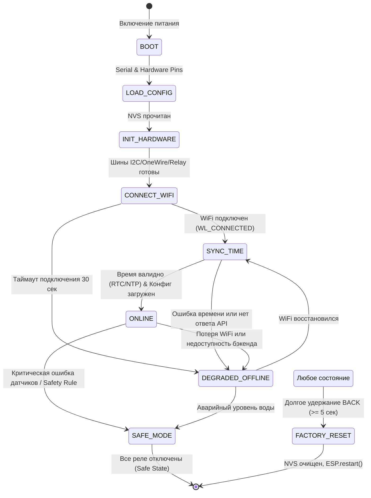

# AquaSmart ESP32 Firmware

Прошивка микроконтроллера **ESP32** для автоматизированной аквариумной системы **AquaSmart**.  
Обеспечивает опрос датчиков, локальное автоматическое управление реле, отказоустойчивое сохранение данных, синхронизацию времени и двустороннюю связь с облачным бэкендом.

---

## 1. Архитектура и стек технологий

- **Микроконтроллер:** ESP32 Dev Module (WROOM-32 / ESP32-D0WDQ6)
- **Фреймворк:** Arduino Core for ESP32
- **Среда разработки:** PlatformIO
- **Текущая версия прошивки:** `1.0.0`
- **Протокол связи с бэкендом:** HTTP REST (JSON) с пакетной передачей
- **Авторизация:** Привязка пары `X-Device-Token` + `X-Mac-Address`
- **Отказоустойчивость:** Автономная работа (Offline Mode) с сохранением телеметрии в RAM кольцевой очереди до 100 записей

---

## 2. Аппаратная карта подключений (Pinout)

Все аппаратные назначения зафиксированы в [PinMap.h](src/PinMap.h):

| Функция / Модуль | GPIO | Тип сигнала / Протокол | Примечание |
| :--- | :---: | :--- | :--- |
| **I2C SDA** | `21` | Двунаправленная шина I2C | LCD2004 (`0x27`), AHT20 (`0x38`), RTC (`0x68`) |
| **I2C SCL** | `22` | Тактовая шина I2C | Подтяжка 4.7k к 3.3V |
| **1-Wire Bus** | `4` | Цифровая шина OneWire | Датчики температуры DS18B20 (подтяжка 4.7k) |
| **Датчик уровня воды** | `34` | Цифровой вход (GPI) | Поплавковый/оптический сенсор (Active HIGH) |
| **Влажность почвы / субстрата** | `32` / ADC | Аналоговый вход | Емкостной датчик влажности (Soil Moisture) |
| **Реле Канал 1** | `16` | Цифровой выход (Active LOW) | Фильтр / аэрация |
| **Реле Канал 2** | `17` | Цифровой выход (Active LOW) | Нагреватель / водонагреватель |
| **Реле Канал 3** | `18` | Цифровой выход (Active LOW) | Освещение |
| **Реле Канал 4** | `19` | Цифровой выход (Active LOW) | Помпа долива / СО2 |
| **Реле Канал 5** | `25` | Цифровой выход (Active LOW) | Дополнительный канал |
| **Реле Канал 6** | `26` | Цифровой выход (Active LOW) | Дополнительный канал |
| **Реле Канал 7** | `27` | Цифровой выход (Active LOW) | Дополнительный канал |
| **Реле Канал 8** | `32` | Цифровой выход (Active LOW) | Дополнительный канал |
| **Энкодер CLK** | `33` | Цифровой вход (Pullup) | Поворот энкодера |
| **Энкодер DT** | `35` | Цифровой вход (GPI) | Направление вращения |
| **Кнопка энкодера (SW)** | `36` | Цифровой вход (GPI, Pullup) | Подтверждение / Выбор |
| **Кнопка BACK (EXT)** | `39` | Цифровой вход (GPI, Pullup) | Назад / Сброс к заводским |
| **LED Online** | `13` | Цифровой выход | Статус подключения к бэкенду |
| **LED WiFi** | `14` | Цифровой выход | Статус подключения к сети WiFi |
| **LED Degraded** | `23` | Цифровой выход | Работа в оффлайн-режиме |
| **LED Error** | `12` | Цифровой выход | Аварийный режим / ошибки |
| **LED Activity** | `2` | Цифровой выход | Индикация импульса активности |

---

## 3. Двухуровневая модель конфигурации

Конфигурация устройства разделена на **статическую энергонезависимую** (хранится во flash-памяти ESP32) и **динамическую серверную** (загружается с бэкенда при наличии связи).

```
┌────────────────────────────────────────────────────────┐
│               1. Энергонезависимый NVS                 │
│         (хранится в Preferences "aqua-config")         │
│  • WiFi SSID & Password                                │
│  • Base API URL (например, http://192.168.1.100:5237)   │
│  • Device Token (GUID)                                 │
│  • Controller ID (GUID)                                │
│  • Аппаратные 1-Wire адреса (ds18water, ds18surface)   │
│  • Базовые интервалы и калибровки сенсоров             │
└───────────────────────────┬────────────────────────────┘
                            │ При подключении к сети
                            ▼
┌────────────────────────────────────────────────────────┐
│             2. Динамический Runtime Config             │
│        (GET /api/device/v1/controllers/me/config)      │
│  • Список активных датчиков, их роли и интервалы       │
│  • Назначение каналов реле (purpose) и целевой статус   │
│  • Правила безопасности (пороги температуры, аварии)   │
│  • Серверный sendIntervalMs и maxBatchSize             │
└────────────────────────────────────────────────────────┘
```

### Параметры NVS по умолчанию ([ConfigStore.cpp](src/ConfigStore.cpp))
При первом запуске или после Factory Reset используются безопасные значения:
- `interval`: 10000 мс (интервал отправки пакетов телеметрии)
- `batch`: 50 записей (максимальный размер отправляемого пакета)
- `queue`: 100 записей (емкость очереди неотправленной телеметрии)
- `cmdPoll`: 3000 мс (частота опроса очереди команд бэкенда)
- `lvlDebounce`: 150 мс (фильтрация дребезга датчика уровня воды)

---

## 4. Конечный автомат прошивки (FSM)

Работа микроконтроллера управляется конечным автоматом состояний ([AppState.h](src/AppState.h)):



### Описание состояний:
- **`BOOT`**: Первичная инициализация тактирования, UART 115200 бод, вывод баннера версии `v1.0.0`.
- **`LOAD_CONFIG`**: Инициализация NVS (`Preferences`), загрузка сетевых учетных данных и аппаратных адресов.
- **`INIT_HARDWARE`**: Инициализация шин I2C (`Wire`), OneWire, датчика уровня воды, реле в начальном безопасном состоянии, энкодера и LCD.
- **`CONNECT_WIFI`**: Запуск фонового подключения к точке доступа (`WiFi.setAutoReconnect(true)`). Если соединение не установлено в течение 30 секунд, система переходит в `DEGRADED_OFFLINE`.
- **`SYNC_TIME`**: Синхронизация времени по аппаратному модулю RTC (DS3231/DS1307) и NTP.
- **`ONLINE`**: Штатный режим:
  - Опрос датчиков по индивидуальным таймерам;
  - Буферизация измерений в очередь телеметрии;
  - Пакетная отправка телеметрии на бэкенд (`sendQueuedTelemetry`);
  - Опрос и выполнение команд управления реле (`processPendingCommands`);
  - Обновление экрана и светодиодных индикаторов.
- **`DEGRADED_OFFLINE`**: Автономный режим без доступа к облаку:
  - Измерения датчиков продолжают сохраняться в кольцевую RAM-очередь (до 100 записей);
  - Локальная автоматика продолжает работать (защита от сухого хода, поддержание температуры);
  - Дисплей отображает статус `OFFLINE`;
  - При восстановлении сети накопленные данные пакетами уходят на сервер без потерь.
- **`SAFE_MODE`**: Защитный режим при фатальных сбоях: принудительное отключение всех силовых нагрузок (`setAllSafe()`).
- **`FACTORY_RESET`**: Полная очистка энергонезависимой памяти и перезагрузка контроллера.

---

## 5. Взаимодействие с Backend API

Каждый исходящий HTTP-запрос от контроллера сопровождается обязательными заголовками аутентификации:

| Заголовок | Значение | Назначение |
| :--- | :--- | :--- |
| `X-Device-Token` | `39392510-96dc-4aa4-...` | Секретный токен контроллера |
| `X-Mac-Address` | `AA:BB:CC:DD:EE:FF` | Физический MAC-адрес ESP32 (проверяется бэкендом) |
| `X-Firmware-Version` | `1.0.0` | Версия прошивки для контроля совместимости |
| `Content-Type` | `application/json` | Формат данных |

### Эндпоинты интеграции:
1. **Загрузка конфигурации:**  
   `GET /api/device/v1/controllers/me/config`  
   Возвращает список сенсоров, адресов, назначение реле и интервалы.
2. **Отправка телеметрии (пакетная):**  
   `POST /api/device/v1/sensors/telemetry`  
   Тело запроса:
   ```json
   {
     "controllerId": "3afee932-b839-439c-b31b-45d83bb5569b",
     "records": [
       {
         "sensorId": "11111111-2222-3333-4444-555555555555",
         "sensorLocalKey": "water_temperature",
         "value": 24.8,
         "measuredAt": "2026-10-02T14:30:00Z"
       }
     ]
   }
   ```
3. **Опрос ожидающих команд:**  
   `GET /api/device/v1/commands/pending/{controllerId}`  
   Возвращает список команд на переключение каналов реле.
4. **Подтверждение исполнения команды:**  
   `POST /api/device/v1/commands/{commandId}/complete`
5. **Уведомление о сбое команды:**  
   `POST /api/device/v1/commands/{commandId}/fail`

---

## 6. Пользовательский интерфейс и управление (UI)

Управление контроллером осуществляется с помощью поворотного энкодера с кнопкой и отдельной клавиши `BACK`.

### Экраны дисплея (Display Pages):
1. **`STATUS`**: Общий статус системы (Состояние FSM, температура воды, аварии).
2. **`NETWORK`**: IP-адрес устройства, MAC-адрес, уровень сигнала WiFi RSSI.
3. **`QUEUE`**: Количество записей в очереди телеметрии, отправлено пакетов.
4. **`SENSOR`**: Подробный постраничный просмотр всех обнаруженных датчиков и сырых значений.
5. **`RELAY`**: Текущее состояние всех 8 реле (ручное переключение нажатием энкодера).
6. **`ERROR`**: Текущий код ошибки и диагностическое сообщение.

### Навигация и горячие клавиши:
- **Вращение энкодера (влево/вправо):** Перелистывание экранов или выбор датчика/реле.
- **Короткое нажатие энкодера:** Подтверждение выбора / переключение выбранного реле на экране `RELAY`.
- **Долгое нажатие энкодера (>= 1.2 сек):** Быстрый переход на экран ошибок (`ERROR`).
- **Короткое нажатие кнопки BACK:** Возврат на экран `STATUS`.
- **Длинное нажатие кнопки BACK (>= 1.5 сек):** Быстрый переход на экран сети `NETWORK`.
- **Сверхдлинное удержание кнопки BACK (>= 5 сек):** **Factory Reset** (сброс NVS до заводских настроек и перезагрузка контроллера).

---

## 7. Сборка и прошивка

### Требования:
- Установленный **VS Code** с расширением **PlatformIO IDE** или **PlatformIO Core CLI** (`pio`).

### Сборка через CLI:
```powershell
# Переход в папку прошивки
cd firmware/AquaSmart_ESP32

# Компиляция проекта
pio run

# Запуск компиляции с подробным логом
pio run -v
```

### Загрузка в контроллер по USB:
```powershell
# Прошивка контроллера через автоматически определенный COM-порт
pio run --target upload

# Прошивка с указанием конкретного порта (например, COM3)
pio run --target upload --upload-port COM3
```

### Мониторинг Serial-порта:
```powershell
# Запуск монитора на скорости 115200 бод
pio device monitor -b 115200
```

При успешном старте в мониторе отобразится лог:
```text
[BOOT] AquaSmart firmware v1.0.0
[WiFi] Initiating connection to MyWiFi...
[WiFi] Connected!
[WiFi] IP: 192.168.1.145
[WiFi] MAC: 30:AE:A4:07:0B:44
[DEBUG] URL: http://192.168.1.100:5237/api/device/v1/controllers/me/config
[DEBUG] Mac: 30:AE:A4:07:0B:44
[DEBUG] Token: 39392510****
[API] Runtime config loaded successfully!
```
